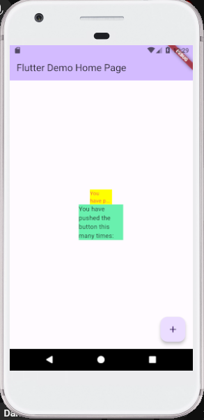

# flutter_plugin__pubdev

A new Flutter project.

## Getting Started

# Praktikum Menerapkan Plugin di Project Flutter

Langkah 1: Buat Project Baru

Langkah 2: Menambahkan Plugin

Langkah 3: Buat file red_text_widget.dart

Langkah 4: Tambah Widget AutoSizeText

Langkah 5: Buat Variabel text dan parameter di constructor

Langkah 6: Tambahkan widget di main.dart

HASIL PRAKTIKUM

# Tugas Praktikum

1. Jelaskan maksud dari langkah 2 pada praktikum tersebut!

- Command pada langkah 2 merupakan perintah untuk memanggil package yang akan ditambahkan pada sebuah proyek. Dengan menjalankan perintah tersebut juga akan menambahkan pustaka 'auto_size_text' pada berkas pubspec.yaml di proyek Flutter.

2. Jelaskan maksud dari langkah 5 pada praktikum tersebut!

- Maksud dari langkah 5 menambahkan final String text yaitu agar varibel text yang terdapat di bawahnya bisa diakses, sedangkan menambahkan required this.text yaitu "required" sendiri merupakan kata kunci yang digunakan untuk menandakan bahwa parameter 'text' adalah wajib diisi.

3. Pada langkah 6 terdapat dua widget yang ditambahkan, jelaskan fungsi dan perbedaannya!

- Perbedaan dari dua widget yang ditambahkan yaitu warna latar belakang (color) dan lebar (width) dari kedua Container. Selain itu, komponen anak (child) pada Container pertama adalah RedTextWidget, sementara komponen anak pada Container kedua adalah Text yang merupakan widget bawaan Flutter.

4. Jelaskan maksud dari tiap parameter yang ada di dalam plugin auto_size_text berdasarkan tautan pada dokumentasi ini !

- Parameter key* = parameter yang digunakan untuk mengidentifikasi widget secara unik dalam pohon widget (widget tree). Ini berguna ketika ingin mengganti atau memperbarui widget tertentu dalam pohon tanpa harus membangun ulang seluruh pohon widget.

- Parameter textKey = Penggunaan kunci (key) ini penting dalam beberapa kasus, seperti ketika perlu mengidentifikasi widget Teks secara unik dalam pohon widget atau ketika ingin memodifikasi atau menggantikan widget Teks tersebut tanpa mempengaruhi widget lain dalam pohon.

- Parameter style* = Parameter yang digunakan untuk mengatur gaya (style) dari teks yang akan ditampilkan. Jika parameter "style" tidak null (atau memiliki nilai yang valid), maka gaya yang didefinisikan dalam parameter tersebut akan diterapkan pada teks yang akan ditampilkan.

- Parameter maxLines = Parameter ini memungkinkan Anda untuk menentukan jumlah maksimum baris yang digunakan oleh teks.

- Parameter minFontSize = Parameter ini untuk menentukan ukuran huruf minimum yang akan digunakan ketika teks disesuaikan.

- Parameter maxFontSize = Parameter ini memungkinkan untuk menentukan ukuran huruf maksimum yang akan digunakan ketika teks disesuaikan.

- Parameter overflow = parameter ini untuk menentukan perilaku teks saat tidak muat dalam ruang yang tersedia.

- Parameter textAlign = Parameter ini memungkinkan untuk mengatur penempatan teks, seperti rata kiri, tengah, atau kanan, sesuai kebutuhan.
s
- Parameter textDirection = Parameter ini untuk mengatur arah penulisan teks, seperti dari kiri ke kanan atau dari kanan ke kiri, sesuai dengan bahasa yang digunakan dalam teks.

- Parameter presetFontSizes = Parameter ini memungkinkan untuk mengatur daftar ukuran huruf yang akan digunakan untuk mencocokkan ukuran teks. Ini memungkinkan untuk mengendalikan ukuran huruf yang digunakan dalam skala tertentu.

This project is a starting point for a Flutter application.

A few resources to get you started if this is your first Flutter project:

- [Lab: Write your first Flutter app](https://docs.flutter.dev/get-started/codelab)
- [Cookbook: Useful Flutter samples](https://docs.flutter.dev/cookbook)

For help getting started with Flutter development, view the
[online documentation](https://docs.flutter.dev/), which offers tutorials,
samples, guidance on mobile development, and a full API reference.
